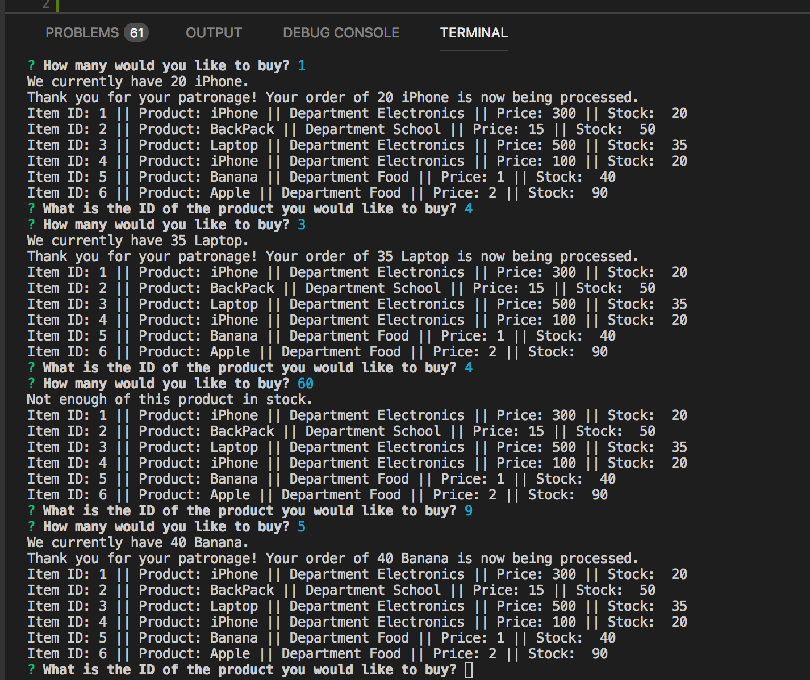

# bamazon

An storefront that runs in the console using node. This storefront has similiar basic functionality as a Amazon. A Customer can select an item (ID), order quantity and determine if there is sufficient stock for the item selected.

#How It Works

Bamazon Customer This program consists of three seperate, but related apps. The first, BamazonCustomer.js, allows a "customer" to place an order from the Bamazon store. A check is then performed on the store inventory and the customer is either alerted that their order cannot be completed. Behind the scenes, the quantity ordered by the customer is deducted from the store quantity 

###BamazonCustomer.js Screenshot

